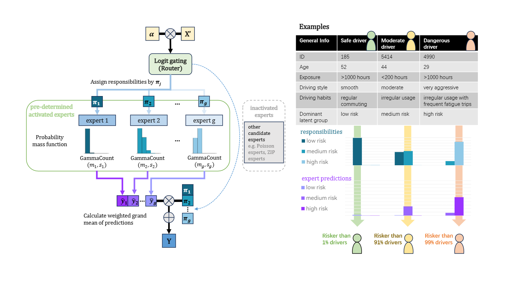

# UBItelematics
*(building of this repository is still in progress, expected to be completed by the end of 2025)*

## Overview
This repository contains the source code, simulation data, and for the paper **PAPER TITLE**. It implements a dynamic pricing framework based on the logit-reduced mixture-of-experts model ([LRMoE.jl](https://actsci.utstat.utoronto.ca/LRMoE.jl/stable/)) designed for usage-based auto insurance pricing. The primary languages used in this repository are [Julia](https://julialang.org/) and [R](https://www.r-project.org/). 

The dataset `SimUBIDataset.jld2` is a cleaned simulation driving behavior dataset containing daily-summarized statistics for 553 drivers, mirroring their long-term driving behavior through a day-to-day time window. JLD2 stands for Julia Data Format 2, a file format and serialization library tailored to work seamlessly with native Julia types. Original dataset cannot be made public due to data usage limitations.

To initialize, use `setup.jl` to set up the main module for implementation.

To implement R code in julia, run `Pkg.add("RCall"); Pkg.build("RCall"); using RCall`, and specify the local path to your R installation using `ENV["R_HOME"] = "your/local/R/path"`.

Special thanks are due to [LRMoE.jl](https://actsci.utstat.utoronto.ca/LRMoE.jl/stable/). We sincerely appreciate the developers for creating such a efficient and reliable tool.
